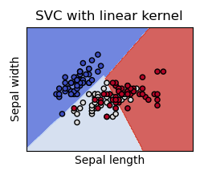

# Laporan Proyek Machine Learning - Achmad makarim widyanto

## Domain Proyek
Analisis Penerapan Feature Engineering TF-IDF terhadap Metode Machine Learning(Studi Kasus Toxic Comment Classification)

### Latar Belakang
Ujaran kebencian, perkataan kasar, menghina seseorang dan merendahkan seseorang pada media sosial online menjadi permasalahan yang begitu serius di masa saat ini, efek yang ditimbulkan dari perbuatan tersebut dapat mengganggu kesehatan mental seseorang yang menjadi korban. Menggunakan metode machine learning dapat membantu pengecekan apakah komentar dalam sebuah konten termasuk dalam buruk atau tidak. Terlepas dari hal tersebut, tentunya membutuhkan sebuah metode klasifakasi yang akurat supaya dapat menentukan apakah teks dari komentar pengguna termasuk toxic atau tidak. Apabila membuat sebuah model yang buruk akan dapat tidak berfungsi dengan baik pengklasifikasian teks yang akan digunakan nantinya.

## Business Understanding
Tahap ini berisikan penjelasan masalah yang akan diselesaikan.

Bagian laporan ini mencakup:

### Problem Statements
Menjelaskan pernyataan masalah latar belakang:
- Metode Machine learning untuk klasifikasi toxic comment apa yang berpengaruh terhadap feature engineering TF-IDF?
- Metode apa yang menghasilkan akurasi yang lebih baik terhadap toxic comment?

### Goals
- Mendapatkan metode machine learning yang dapat mengklasifikasikan toxic comment dengan lebih akurat
- Mengetahui efek dari feature engineering TF-IDF terhadap pengklasifikasian.

## Solution statements
Hasil dari analisis dan evaluasi model dari beberapa metode machine learning yang paling terbaik yang nantinya akan dipakai.
- **Stochastic Gradient Descent (SGD)** 
{stochasitic.png}
SGD adalah pendekatan yang sederhana namun sangat efisien untuk menyesuaikan pengklasifikasi linier dan regressor di bawah fungsi kerugian cembung seperti (linier) Support Vector Machines dan Logistic Regression. Meskipun SGD telah ada di komunitas pembelajaran mesin untuk waktu yang lama, baru-baru ini telah menerima banyak perhatian dalam konteks pembelajaran skala besar.
kelebihan:
kekurangan:

- **Support Vector Machines (SVM)**

SVM digunakan untuk mencari hyperplane terbaik dengan memaksimalkan jarak antar kelas. Hyperplane adalah sebuah fungsi yang dapat digunakan untuk pemisah antar kelas. Dalam 2-D fungsi yang digunakan untuk klasifikasi antar kelas disebut sebagai line whereas, fungsi yang digunakan untuk klasifikasi antas kelas dalam 3-D disebut plane similarly, sedangan fungsi yang digunakan untuk klasifikasi di dalam ruang kelas dimensi yang lebih tinggi di sebut hyperplane.
kelebihan:
kekurangan:

- **Neirest Neighbors**
{neirest neighbors.png}
Neirest neighbors adalah jenis pembelajaran berbasis instance atau pembelajaran non-generalisasi: ia tidak mencoba membangun model internal umum, tetapi hanya menyimpan instance dari data pelatihan. Klasifikasi dihitung dari suara mayoritas sederhana dari tetangga terdekat dari setiap titik: titik kueri diberikan kelas data yang memiliki perwakilan paling banyak dalam tetangga terdekat dari titik tersebut.
kelebihan:
kekurangan:

- **Decision Tree**
{decision tree.png}
Decision Trees (DTs) adalah metode pembelajaran terawasi non-parametrik yang digunakan untuk klasifikasi dan regresi. Tujuannya adalah untuk membuat model yang memprediksi nilai variabel target dengan mempelajari aturan keputusan sederhana yang disimpulkan dari fitur data. Sebuah pohon dapat dilihat sebagai pendekatan konstan sepotong demi sepotong.

Misalnya, dalam contoh di bawah ini, pohon keputusan belajar dari data untuk memperkirakan kurva sinus dengan seperangkat aturan keputusan jika-maka-lain. Semakin dalam pohonnya, semakin kompleks aturan keputusannya dan semakin fit modelnya.
kelebihan:
kekurangan:

- **Neural Network MLP**
{gambar}
Multi-layer Perceptron (MLP) adalah algoritma pembelajaran terawasi yang mempelajari suatu fungsi dengan pelatihan pada dataset, di mana adalah jumlah dimensi untuk input dan adalah jumlah dimensi untuk output. Diberikan serangkaian fitur dan target , ia dapat mempelajari aproksimator fungsi non-linier untuk klasifikasi atau regresi. Berbeda dengan regresi logistik, di antara lapisan input dan output dapat terdapat satu atau lebih lapisan non-linier, yang disebut lapisan tersembunyi. Gambar 1 menunjukkan MLP satu lapisan tersembunyi dengan output skalar.
kelebihan:
kekurangan:

- **K Neirest Neigbors (KNN)**
{knn.png}
KNN merupakan pemblajaran supervised learning dimana hasil dari instance yang baru diklasifikasikan berdasarkan hasil dari mayoritas nilai kategori k tetangga terdekatnya.
kelebihan:
kekurangan:

- **Linear SVC**
{linear svc.png}
Linear SVC merupakan pengembalian hyperplane paling sesuai atau mengkategorikan data, kemudia hyperplane dapat memasukkan beberapa fitur ke classifier untuk melihat kelas prediksi.
kelebihan:
kekurangan:

## Data Understanding

### Data Collection
Paragraf awal bagian ini menjelaskan informasi mengenai jumlah data, kondisi data, dan informasi mengenai data yang digunakan. Sertakan juga sumber atau tautan untuk mengunduh dataset.

Silahkan unduh dataset yang saya gunakan [Jigsaw Toxic Comment](https://www.kaggle.com/c/jigsaw-toxic-comment-classification-challenge/data), dan juga [Jigsaw Rate Severity](https://www.kaggle.com/pablorosa01/naive-bayes-modeling-base-line/data?scriptVersionId=80103579)

data_train: train.csv
data_validation: validation_data.csv
data_testing: test.csv

Selanjutnya uraikanlah seluruh variabel atau fitur pada data. Sebagai contoh:  

### Variabel-variabel pada Toxic Comment dataset adalah sebagai berikut:
- comment_text : merupakan komentar-komentar dari pengguna media sosial.
- toxic, severe_toxic, obscene, threat, insult, identity_hate : merupakan jenis kategori toxic.

|	     |                id|	                                    comment_text|toxic|severe_toxic|obscene|threat|insult|identity_hate|
|------|------------------|-------------------------------------------------|-----|------------|-------|------|------|-------------|
|     0|	0000997932d777bf|Explanation\nWhy the edits made under my usern...|	   0|          	0|   	  0|     0|   	0|          	0|
|     1|	000103f0d9cfb60f|D'aww! He matches this background colour I'm s...|	   0|          	0|   	  0|     0|   	0|          	0|
|     2|	000113f07ec002fd|Hey man, I'm really not trying to edit war. It...|	   0|          	0|   	  0|     0|   	0|          	0|
|     3|	0001b41b1c6bb37e|"\nMore\nI can't make any real suggestions on ...|	   0|          	0|   	  0|     0|   	0|          	0|
|     4|	0001d958c54c6e35|You, sir, are my hero. Any chance you remember...|	   0|          	0|   	  0|     0|   	0|          	0|
|......| .................|.................................................|.....|............|.......|......|......|.............|
|159566|	ffe987279560d7ff|	":::::And for the second time of asking, when...|	   0|          	0|   	  0|     0|   	0|          	0|
|159567|	ffea4adeee384e90|	You should be ashamed of yourself \n\nThat is...|	   0|          	0|   	  0|     0|   	0|          	0|
|159568|	ffee36eab5c267c9|	Spitzer \n\nUmm, theres no actual article for...|	   0|          	0|   	  0|     0|   	0|          	0|
|159569|	fff125370e4aaaf3|	And it looks like it was actually you who put...|	   0|          	0|   	  0|     0|   	0|          	0|
|159570|	fff46fc426af1f9a|	"\nAnd ... I really don't think you understand..|	   0|          	0|   	  0|     0|   	0|          	0|
|159571| rows × 8 columns

## EDA
{wordcloud.png}

## Data Preparation
Pada bagian ini Anda menerapkan dan menyebutkan teknik data preparation yang dilakukan. Teknik yang digunakan pada notebook dan laporan harus berurutan.

### Clean Text
**NLTK Stop Words**
stopwords adalah menghiangkan kata-kata yang tidak diperlukan dalam pelatihan data teks, seperti kata-kata imbuhan "the", "an", "of" dan lain-lain.

## Feature Engineering
Bagian ini menentukan fitur-fitur apa saja yang nantinya berperan penting dalam pelatihan data.

### Scoring
{scoring.png}
Menghitung banyaknya teks berdasarkan jenis toxicnya.

**Term Frequency — Inverse Document Frequency(TF-IDF)**
{tf.png}
{idf.png}
{tf-idf.png}
Suatu teknik untuk menghitung banyaknya kata dalam suatu teks dimana tujuannya adalah mencaritahu seberapa penting kata itu dalam suatu teks. 

## Modeling
Tahapan ini membahas mengenai model machine learning yang digunakan untuk menyelesaikan permasalahan. Anda perlu menjelaskan tahapan dan parameter yang digunakan pada proses pemodelan.

**Naive Bayes**
kelebihan: 
1. salah satu algoritma yang bekerja dengan cepat dan dapat menghemat waktu komputasi.
2. cocok untuk mengatasi multi-class
3. sesuai pada data kategorikal dibanding numerical
kekurangan:
1. minim pengaplikasian terhadap kasus sesungughnya
2. estimasinya dapat salah dalam beberapa kasus

**KNN**
kelebihan:
1. tidak berpaku terhadap data sebelumnya
2. tidak perlu dilatih
3. mudah diimplementasikan
kekurangan:
1. lemah dalam data yang besar
2. kurang baik terhadap dimenasi data yang tinggi
3. butuh penskalaan fitur

**Neirest Centroid**
kelebihan:
1. mudah dalam pengimplementassiannya
2. efisien dalam waktu pelatihan data
3. tidak memerlukan parameter dalam pelatihan data

kekurangan:
1. lemah dalam penanganan outlier yang banyak

**SVM**
kelebihan:
1. akurasi bagus 
2. mudah mengatur nonlinier data
3. minim terhadap overfitting
kekurangan:
1. komputasi tinggi
2. membutuhkan waktu training lebih lama

**Stochastic Gradient Descent**
kelebihan:
1. cepat dalam komputasi
2. ketika slow komputasi SGD dapat menghasilkan nilai yang sama(konsisten)
kekurangan:
1. akan tetap overshooting ketika melatih data yang kompleks

**Linear SVC**
kelebihan:
1. efektif dalam dimensi data yang tinggi
2. memori yang ringan
kekurangan:
1. sulit dalam data yang besar
2. tidak dapat menangani noise yang banyak

**Neural Network**
kelebihan:
1. dapat menangani data yang complex antara dependent dengan independent
2. bisa menghandle noisy data
kekurangan:
1. berpotensi lebih over fitting
2. komputasi yang tinggi

## Evaluation

**Naive Bayes**
akurasi non TF-IDF: 0.5916795069337443
akurasi TF-IDF: 0.5983564458140729

**Decision Tree**
akurasi non TF-IDF: 0.5490498202362609
akurasi TF-IDF: 0.5662557781201849

**KNN**
akurasi non TF-IDF: 0.5916795069337443
akurasi TF-IDF: 0.536723163841808

**Neirest Neighbors**
akurasi non TF-IDF: 0.5659989727786338
akurasi TF-IDF:  0.5834617360041089

**SVM**
akurasi non TF-IDF: 0.5441705187467899
akurasi TF-IDF: 0.6366204417051875

**Stochastic Gradient Descent**
akurasi non TF-IDF: 0.5359527478171546
akurasi TF-IDF: 0.6212121212121212

**Linear SVC**
akurasi non TF-IDF: 0.5693374422187981
akurasi TF-IDF: 0.6076014381099127

**Neural Network(MLP)**
akurasi non TF-IDF: 0.5842321520287622
akurasi TF-IDF: 0.5772984078068824

|	                     |  non-tfidf|	   tfidf|
|----------------------------|-----------|--------------|
|naive_bayes                 |	 0.591680|	0.598356|
|knn                         |	 0.591680|	0.536723|
|neural_network              |	 0.584232|	0.577298|
|linear_svc                  |	 0.569337|	0.607601|
|neirest_neighbors           |	 0.565999|	0.583462|
|stochastic_Gradient_Descent |	 0.535953|	0.621212|
|svm                         |	 0.544171|	0.636620|
|decision_tree               |	 0.549050|	0.566256|

{evaluasi.png}

terdapat tujuh algoritma yang dipakai

Refrensi:
- https://scikit-learn.org/stable/supervised_learning.html#supervised-learning
- https://pythonspot.com/nltk-stop-words/
- https://towardsdatascience.com/tf-idf-for-document-ranking-from-scratch-in-python-on-real-world-dataset-796d339a4089#:~:text=TF%2DIDF%20stands%20for%20%E2%80%9CTerm,Information%20Retrieval%20and%20Text%20Mining.
- https://www.researchgate.net/publication/339576432_Nearest_Centroid_Classifier_with_Outlier_Removal_for_Classification/link/5e59bea0a6fdccbeba0b494f
- https://medium.com/swlh/strengths-and-weaknesses-of-optimization-algorithms-used-for-machine-learning-58926b1d69dd
